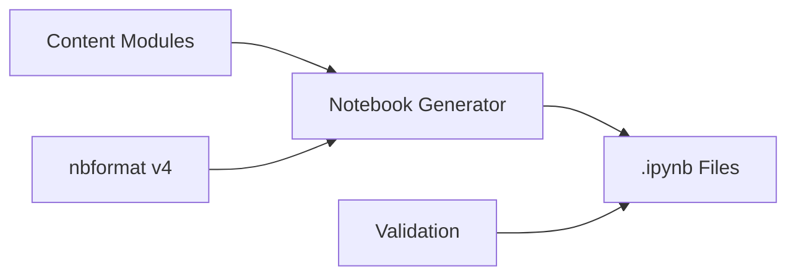
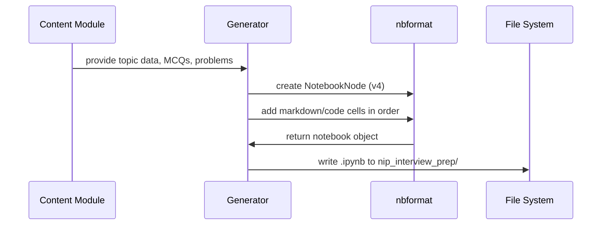

# Design Document: nip Interview Prep Notebooks

## Overview

This feature produces four Jupyter notebooks (.ipynb files) that serve as a self-contained interview preparation course for the nip Senior Software SDET Test Development Engineer HackerRank assessment. Each notebook maps to one timed section of the assessment: DSA (MCQ, 15 min), OS/Linux (MCQ, 25 min), Python coding (30 min), and REST API coding (25 min).

The notebooks are static educational content — no backend, no database, no runtime services. The "system" is a Python script (or set of scripts) that **generates** well-structured `.ipynb` JSON files programmatically, ensuring consistency, correctness, and adherence to the structural requirements. This generation approach allows us to validate notebook structure through automated tests rather than relying on manual inspection.

### Key Design Decisions

1. **Programmatic generation over manual authoring**: Notebooks are generated by Python code so that structural invariants (cell ordering, required sections, MCQ format) can be enforced and tested automatically.
2. **nbformat library**: We use the standard `nbformat` (v4) library to create and validate notebook JSON, avoiding hand-rolled `.ipynb` construction.
3. **Content as data**: Topic content, MCQs, and practice problems are defined in Python data structures, then assembled into notebook cells by the generator. This separates content from presentation logic.
4. **Single output directory**: All four notebooks land in `nip_interview_prep/`.

## Architecture

The system follows a straightforward pipeline architecture:



### Components

1. **Content Modules** — Python modules containing the raw educational content (explanations, code examples, MCQs, practice problems) organized by notebook and topic.
2. **Notebook Generator** — Core engine that takes content data and produces valid `.ipynb` files using `nbformat`.
3. **Validation** — Tests that verify structural correctness of generated notebooks.

### Generation Flow



## Components and Interfaces

### 1. Content Data Structures

Content is represented using Python dataclasses that enforce the required structure:

```python
@dataclass
class MCQ:
    question: str           # Question text (may include code snippet)
    options: dict[str, str] # {"A": "...", "B": "...", "C": "...", "D": "..."}
    correct: str            # One of "A", "B", "C", "D"
    explanation: str        # Why correct answer is right
    distractors: dict[str, str]  # Why each wrong answer is wrong
    mcq_type: str           # "conceptual" | "code_output" | "command" | "complexity"

@dataclass
class PracticeProblem:
    title: str
    statement: str          # Problem description markdown
    function_signature: str # Expected function signature
    examples: list[dict]    # [{"input": ..., "output": ...}]
    solution_code: str      # Complete solution
    test_code: str          # Assert-based test cases
    hints: list[str]        # Optional hints

@dataclass
class TopicSection:
    title: str
    difficulty: str         # "Beginner" | "Mid-Level"
    explanation: str        # Markdown concept explanation
    examples: list[str]     # Code cell contents (worked examples)
    practice: list[MCQ | PracticeProblem]
    key_takeaways: list[str]

@dataclass
class NotebookSpec:
    title: str
    filename: str           # e.g., "01_data_structures_algorithms.ipynb"
    strategy_tips: str      # Markdown for strategy section
    sections: list[TopicSection]  # Ordered: beginner first, then mid-level
    mock_test: list[MCQ | PracticeProblem]
    cheat_sheet: str        # Markdown for quick-reference
```

### 2. Notebook Generator

```python
class NotebookGenerator:
    def generate(self, spec: NotebookSpec) -> nbformat.NotebookNode:
        """Generate a complete notebook from a NotebookSpec."""
        ...

    def _build_toc(self, spec: NotebookSpec) -> nbformat.NotebookNode:
        """Create table of contents markdown cell."""
        ...

    def _build_strategy_tips(self, tips: str) -> nbformat.NotebookNode:
        """Create strategy tips markdown cell."""
        ...

    def _build_topic_section(self, section: TopicSection) -> list[nbformat.NotebookNode]:
        """Convert a TopicSection into ordered notebook cells."""
        ...

    def _build_mcq_cell(self, mcq: MCQ, number: int) -> list[nbformat.NotebookNode]:
        """Create question cell + hidden solution cell for an MCQ."""
        ...

    def _build_practice_problem(self, problem: PracticeProblem) -> list[nbformat.NotebookNode]:
        """Create problem statement + solution cells for a coding problem."""
        ...

    def _build_mock_test(self, items: list, time_limit: str) -> list[nbformat.NotebookNode]:
        """Create timed practice section cells."""
        ...

    def _build_cheat_sheet(self, content: str) -> nbformat.NotebookNode:
        """Create cheat sheet markdown cell."""
        ...

    def write(self, notebook: nbformat.NotebookNode, output_dir: str, filename: str) -> str:
        """Write notebook to disk, return file path."""
        ...
```

### 3. Content Modules

Four content modules, one per notebook:

| Module | File | Provides |
|--------|------|----------|
| DSA Content | `content/dsa.py` | Arrays, linked lists, trees, graphs, sorting, searching MCQs |
| OS/Linux Content | `content/os_linux.py` | Shell commands, process mgmt, networking, Docker, K8s MCQs |
| Python Content | `content/python_coding.py` | String manipulation, OOP, generators, regex practice problems |
| REST API Content | `content/rest_api.py` | HTTP methods, auth, pagination, mock API practice problems |

### 4. Main Entry Point

```python
# generate_notebooks.py
def main():
    generator = NotebookGenerator()
    for spec in [dsa_spec, os_linux_spec, python_spec, rest_api_spec]:
        notebook = generator.generate(spec)
        generator.write(notebook, "nip_interview_prep", spec.filename)
```

## Data Models

### Notebook Cell Structure (nbformat v4)

Each `.ipynb` file is a JSON document following the nbformat v4 schema:

```json
{
  "nbformat": 4,
  "nbformat_minor": 5,
  "metadata": {
    "kernelspec": {
      "display_name": "Python 3",
      "language": "python",
      "name": "python3"
    }
  },
  "cells": [
    {
      "cell_type": "markdown",
      "metadata": {},
      "source": ["# Notebook Title\n"]
    },
    {
      "cell_type": "code",
      "metadata": {},
      "source": ["print('hello')"],
      "execution_count": null,
      "outputs": []
    }
  ]
}
```

### Cell Ordering Per Notebook

Each generated notebook follows this cell order:

1. **Title cell** (markdown) — Notebook title and description
2. **Table of Contents cell** (markdown) — Links to all sections
3. **Strategy Tips cell** (markdown) — Test-taking advice
4. **Topic Sections** (repeated, beginner first):
   - Section heading (markdown) — includes difficulty label
   - Concept explanation (markdown)
   - Worked example(s) (code cells)
   - Practice content (MCQ or coding problem cells)
   - Key Takeaways (markdown)
5. **Timed Practice / Mock Test section** (markdown + MCQ/problem cells)
6. **Cheat Sheet cell** (markdown)

### MCQ Cell Pair Format

Each MCQ produces two cells:
- **Question cell** (markdown): numbered question, code snippet if applicable, four options
- **Solution cell** (markdown): heading "Solution", correct answer, full explanation, distractor notes

### Practice Problem Cell Group

Each coding problem produces:
- **Problem cell** (markdown): title, statement, function signature, examples
- **Starter cell** (code): function stub for candidate to fill in
- **Solution cell** (code): complete solution with inline comments
- **Test cell** (code): assert-based validation


## Correctness Properties

*A property is a characteristic or behavior that should hold true across all valid executions of a system — essentially, a formal statement about what the system should do. Properties serve as the bridge between human-readable specifications and machine-verifiable correctness guarantees.*

### Property 1: Notebook top-level cell ordering

*For any* generated notebook, the cells must appear in this order: title cell, table of contents cell, strategy tips cell, topic sections, timed practice section (with timer instructions), and cheat sheet cell as the final section. No required section may be missing or out of order.

**Validates: Requirements 1.5, 9.1, 9.6, 10.1, 10.4**

### Property 2: Difficulty ordering and labeling

*For any* generated notebook, all topic sections labeled "Beginner" must appear before all topic sections labeled "Mid-Level", every topic section heading must contain its difficulty label ("Beginner" or "Mid-Level"), and there must be at least 3 sections at each difficulty level.

**Validates: Requirements 2.1, 2.2, 2.3, 2.4**

### Property 3: Topic section structure

*For any* topic section in any generated notebook, it must contain (in order): a markdown explanation cell, at least one code cell with inline comments as a worked example, at least one practice item (MCQ or coding problem), and a "Key Takeaways" markdown cell at the end.

**Validates: Requirements 3.1, 3.3, 3.4**

### Property 4: MCQ structural validity

*For any* MCQ in any generated notebook, the question cell must contain a numbered question with exactly four options labeled A, B, C, and D. The solution cell must contain the correct answer letter, an explanation of why it is correct, and notes on why each incorrect option is wrong. For MCQs of type "code_output", the question cell must include a code snippet.

**Validates: Requirements 8.1, 8.3, 8.5**

### Property 5: Solution separation

*For any* MCQ or practice problem in any generated notebook, the solution/answer must be in a separate cell that appears after the question/problem cell. MCQ solution cells must contain a "Solution" heading. Coding problem solution cells must appear below the problem statement cell.

**Validates: Requirements 4.6, 5.6, 6.6, 7.6**

### Property 6: Practice problem test validation

*For any* practice problem in the Python notebook, the test cell must contain at least one `assert` statement that exercises the solution function.

**Validates: Requirements 6.4**

### Property 7: API problems use mock or public data

*For any* practice problem in the REST API notebook, the code cells must reference only mock data (inline dictionaries/JSON) or well-known public APIs (jsonplaceholder.typicode.com, httpbin.org) and must not require proprietary API keys or private endpoints.

**Validates: Requirements 7.4**

### Property 8: Linux command sections include example output

*For any* topic section in the OS/Linux notebook that covers a Linux command, the section must include at least one example command invocation with sample output shown in a code or markdown cell.

**Validates: Requirements 5.5**

### Property 9: DSA sections include implementation and complexity

*For any* data structure or algorithm topic section in the DSA notebook, the section must include a Python code cell implementing the data structure/algorithm and a markdown or comment block stating time and space complexity.

**Validates: Requirements 4.3, 4.5**

### Property 10: NotebookSpec round-trip integrity

*For any* valid `NotebookSpec` object, generating a notebook via `NotebookGenerator.generate()` and then parsing the resulting `.ipynb` JSON back with `nbformat.read()` should produce a valid nbformat v4 notebook with no validation errors.

**Validates: Requirements 1.4**

## Error Handling

Since this system generates static content files, error handling focuses on the generation pipeline:

| Error Scenario | Handling Strategy |
|---|---|
| Invalid NotebookSpec (missing required fields) | Raise `ValueError` with descriptive message during generation. Dataclass field validation catches this at construction time. |
| MCQ with incorrect `correct` field (not A-D) | Validate during `NotebookSpec` construction. Raise `ValueError` if `correct` not in `{"A", "B", "C", "D"}`. |
| MCQ with wrong number of options | Validate `len(options) == 4` and keys are exactly `{"A", "B", "C", "D"}`. |
| Empty topic sections list | Raise `ValueError` — each notebook must have content. |
| Difficulty ordering violation | Generator sorts sections by difficulty (Beginner first) automatically rather than relying on input order. |
| File write failure (permissions, disk space) | Let `OSError` propagate with context about which notebook failed. |
| nbformat validation failure | Run `nbformat.validate()` on generated notebook before writing. Raise on validation errors. |

## Testing Strategy

### Dual Testing Approach

Testing uses both unit tests and property-based tests for comprehensive coverage.

### Unit Tests

Unit tests verify specific examples and edge cases:

- **File output tests**: Verify exactly 4 files are created with correct names in `nip_interview_prep/` (Requirements 1.1, 1.2, 1.3)
- **DSA content tests**: Verify specific topics exist (Arrays, Linked Lists, etc.) and MCQ counts >= 5 per level (Requirements 4.1, 4.2, 4.4)
- **OS/Linux content tests**: Verify specific topics and nip-relevant topics exist, MCQ counts >= 8 per level (Requirements 5.1, 5.2, 5.3, 5.4)
- **Python content tests**: Verify specific topics, nip examples, problem counts >= 4 per level, timing tips (Requirements 6.1, 6.2, 6.3, 6.5, 6.7)
- **REST API content tests**: Verify specific topics, nip examples, problem counts >= 4 per level, reference section (Requirements 7.1, 7.2, 7.3, 7.5, 7.7)
- **Mock test count tests**: DSA 8-10 MCQs, OS/Linux 10-12 MCQs, Python 2-3 problems, REST API 2-3 problems (Requirements 9.2, 9.3, 9.4, 9.5)
- **MCQ type variety test**: Verify multiple MCQ types present across notebooks (Requirement 8.4)
- **Strategy tips content tests**: Verify MCQ notebooks have elimination/timing advice, coding notebooks have brute-force/edge-case advice (Requirements 10.2, 10.3)

### Property-Based Tests

Property-based tests use `hypothesis` library with minimum 100 iterations per test. Each test generates random valid `NotebookSpec` instances and verifies structural invariants.

- **Feature: nip-interview-prep, Property 1: Notebook top-level cell ordering** — Generate random NotebookSpecs, verify cell order invariant
- **Feature: nip-interview-prep, Property 2: Difficulty ordering and labeling** — Generate notebooks with random topic sections, verify beginner-before-mid-level ordering and labels
- **Feature: nip-interview-prep, Property 3: Topic section structure** — Generate random TopicSections, verify each contains explanation → examples → practice → takeaways
- **Feature: nip-interview-prep, Property 4: MCQ structural validity** — Generate random MCQs, verify 4 options A-D, explanation presence, code snippet for code_output type
- **Feature: nip-interview-prep, Property 5: Solution separation** — Generate random MCQs and practice problems, verify solution cells follow question/problem cells
- **Feature: nip-interview-prep, Property 6: Practice problem test validation** — Generate random PracticeProblems, verify test cells contain assert statements
- **Feature: nip-interview-prep, Property 7: API problems use mock or public data** — Generate random REST API problems, verify no proprietary API references
- **Feature: nip-interview-prep, Property 8: Linux command sections include example output** — Generate random OS/Linux command sections, verify example output presence
- **Feature: nip-interview-prep, Property 9: DSA sections include implementation and complexity** — Generate random DSA sections, verify code implementation and complexity analysis
- **Feature: nip-interview-prep, Property 10: NotebookSpec round-trip integrity** — Generate random NotebookSpecs, generate notebook, validate with nbformat

### Test Configuration

- Library: `hypothesis` (Python property-based testing)
- Minimum iterations: 100 per property test (`@settings(max_examples=100)`)
- Custom strategies for generating valid `NotebookSpec`, `TopicSection`, `MCQ`, and `PracticeProblem` instances
- Each property test tagged with comment: `# Feature: nip-interview-prep, Property N: <title>`
